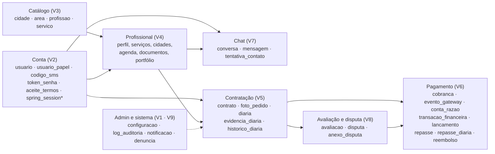
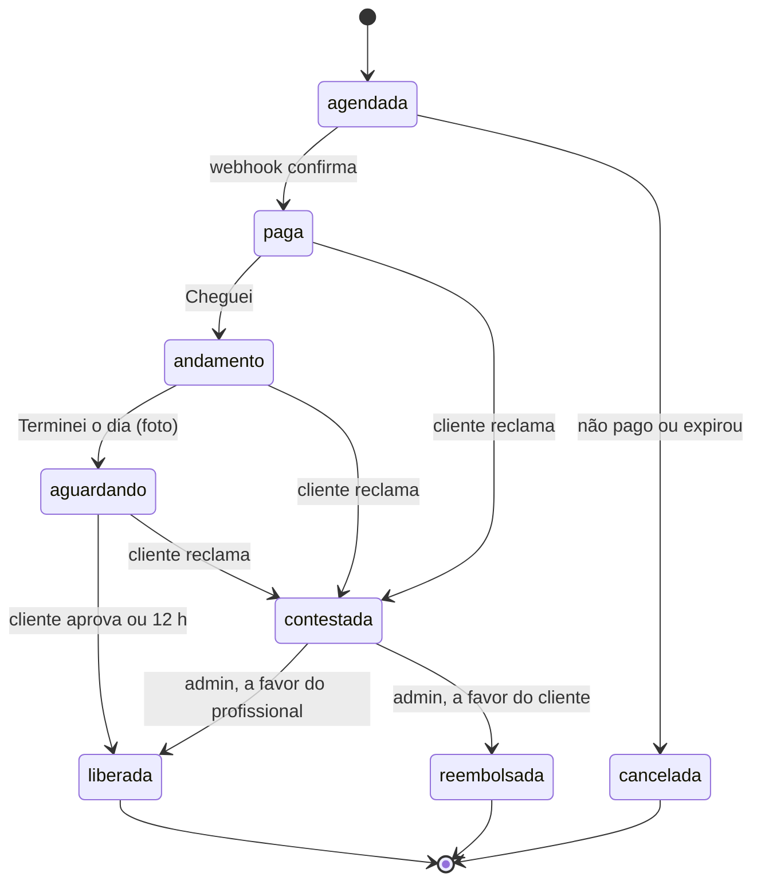

# Mapa do banco: COE Serviços

> Banco `coeservicos`, PostgreSQL 16. O schema é criado pelas migrações Flyway V1–V10 (`src/main/resources/db/migration`); os dados locais ficam em `db/local/R__dados_local.sql`. Este mapa foi gerado do schema real em 01/10/2026 (42 tabelas e 3 views) e atualizado em 02/10/2026 com as correções CRITICAL aplicadas em V1–V10: partidas dobradas por transação, bloqueio de TRUNCATE e papel `coe_app`.
>
> **V11 aplicada em 02/10/2026** (`V11__correcoes_high_e_lacunas_rn.sql`). O dicionário da seção 6 ainda descreve V1–V10; as mudanças da V11 estão na seção 7.
>
> Se o código divergir deste arquivo, **a migração é a fonte da verdade.**

## 1. Visão geral

Os dados correm da esquerda para a direita: catálogo e conta alimentam o perfil do profissional, que vira contrato, que gera dinheiro e avaliação. O admin enxerga e registra tudo.

### Convenções
- PK `uuid` com `gen_random_uuid()`; dinheiro `numeric(12,2)`; percentual `numeric(5,4)`; instantes `timestamptz`; dia de serviço `date`.
- Status em `text` + `CHECK`. `atualizado_em` é atualizado por gatilho; `versao` é controlada pelo JPA (`@Version`).
- CPF, chave Pix e endereço em `bytea`, cifrados pela aplicação; `cpf_hash` (HMAC) garante a unicidade.
- Tabelas **só de inserção** (UPDATE e DELETE barrados por gatilho de linha, TRUNCATE por gatilho de comando, inclusive em cascata): `configuracao`, `historico_diaria`, `transacao_financeira`, `lancamento`, `log_auditoria`.
- **Papéis:** o Flyway roda com o dono do schema; a aplicação usa um login membro de `coe_app` (criado na V1), que recebe SELECT/INSERT/UPDATE/DELETE nas tabelas pelos default privileges, mas só SELECT/INSERT nas tabelas só de inserção. Sem posse, não altera tabela nem desliga gatilho. O acesso de `PUBLIC` ao schema foi retirado.
- As 3 views usam `security_invoker = true`: quem consulta usa os próprios privilégios.

### Views
| View | O que mostra |
|---|---|
| `configuracao_vigente` | Valor em vigor de cada parâmetro (comissão, 12 h, 48 h, LC 150…) |
| `saldo_conta` | Saldo de cada conta do livro-razão (créditos − débitos) |
| `profissional_atende_cidade` | Profissionais ativos que atendem cada cidade ativa, pelo raio (Haversine) ou por cidade marcada, com a distância |

## 2. O caminho de um contrato

| # | No app | No banco | Tabelas |
|---|---|---|---|
| 1 | Cliente cria a conta | Cadastro com celular, CEP e aceite dos termos | `usuario`, `usuario_papel`, `aceite_termos`, `codigo_sms` |
| 2 | Profissional faz o cadastro | 11 etapas salvas como rascunho; ao concluir vai para análise | `profissional`, `profissional_servico`, `profissional_cidade`, `disponibilidade_semanal`, `foto_portfolio`, `documento_verificacao` |
| 3 | Admin aprova | Status vira ativo; ação auditada | `profissional`, `documento_verificacao`, `log_auditoria` |
| 4 | Cliente busca | Só leitura: perfis ativos que atendem a cidade | view `profissional_atende_cidade`, `profissional`, `avaliacao` |
| 5 | Conversa no chat | Mensagem com contato fica bloqueada e conta como tentativa | `conversa`, `mensagem`, `tentativa_contato` |
| 6 | Cliente contrata | Pedido com valores congelados e uma linha por dia | `contrato`, `foto_pedido`, `diaria` |
| 7 | Cliente paga | Webhook confirma; dinheiro entra na custódia; contato liberado | `cobranca`, `evento_gateway`, `transacao_financeira`, `lancamento`, `diaria` |
| 8 | Dia de serviço | Cheguei e terminei com foto; começa a contar o prazo | `diaria`, `evidencia_diaria`, `historico_diaria` |
| 9 | Aprovação ou 12 h | Diária liberada; a custódia vai para o profissional e para a COE | `diaria`, `transacao_financeira`, `lancamento`, `historico_diaria` |
| 10 | Repasse Pix | Diárias liberadas viram um envio Pix | `repasse`, `repasse_diaria`, `transacao_financeira`, `lancamento` |
| 11 | Avaliação | Nota dos dois lados; média no perfil | `avaliacao`, `profissional` |
| ! | Reclamação | Só aquele dia trava; a equipe libera ou reembolsa | `disputa`, `anexo_disputa`, `diaria`, `reembolso`, `transacao_financeira`, `lancamento` |

## 3. Estados da diária (`diaria.status`)

O banco aceita só esses valores; a ordem das transições é validada pela aplicação. Toda troca grava `historico_diaria`.

## 4. O caminho do dinheiro (livro-razão)

Cada movimento é uma `transacao_financeira` com lançamentos de débito (D) e crédito (C) que somam zero, conferidos no COMMIT. Transação sem lançamentos é recusada, e lançamentos só entram na mesma transação do banco que criou a `transacao_financeira` (depois do COMMIT ela está fechada). Exemplo: diária de R$ 280,00 com comissão de 10% paga pelo cliente.

| Momento | Débito | Crédito | Valor |
|---|---|---|---|
| Pagamento confirmado | gateway | custodia | R$ 308,00 |
| Diária liberada | custodia R$ 308,00 | profissional R$ 280,00 + receita_coe R$ 28,00 | R$ 308,00 |
| Repasse Pix | profissional | gateway | R$ 280,00 |
| Reembolso (devolve o que o cliente pagou) | custodia | cliente | R$ 308,00 |
| Estorno enviado | cliente | gateway | R$ 308,00 |

Saldo = créditos − débitos (view `saldo_conta`). A conta `gateway` fica negativa: é o dinheiro parado no gateway. Se a taxa for do profissional (PA05), o cliente paga R$ 280,00; na liberação, o profissional recebe R$ 252,00 e a COE, R$ 28,00.

## 5. O que o banco barra sozinho

| Situação | Constraint / gatilho |
|---|---|
| Profissional com duas diárias ativas no mesmo dia | `uq_diaria_agenda_profissional` |
| Diária com cliente ou profissional diferente do contrato | `fk_diaria_contrato` (FK composta) |
| Total do contrato que não fecha com serviços + comissão | `ck_contrato_total` |
| Status fora da lista | `diaria_status_check` |
| Diária aguardando sem "terminei" e sem prazo | `ck_diaria_aguardando` |
| Profissional fora de rascunho com cadastro incompleto | `ck_profissional_completo` |
| Transação com débitos diferentes dos créditos, ou sem lançamentos | `trg_transacao_partidas` (no COMMIT) |
| Lançamento anexado a uma transação já fechada | `trg_lancamento_transacao_aberta` |
| TRUNCATE em lançamento, transação, histórico, auditoria ou configuração | `trg_<tabela>_sem_truncate` |
| Aplicação alterando o ledger ou desligando gatilhos | privilégios do papel `coe_app` |
| Mesma chave de idempotência duas vezes | `uq_transacao_idempotencia` |
| Alterar ou apagar lançamento, histórico, auditoria ou configuração | `fn_somente_insercao` |
| Mesmo webhook (assinatura válida) duas vezes | `uq_evento_gateway` (parcial, V11) |
| Alterar o conteúdo de um webhook recebido | `trg_evento_gateway_imutavel` (V11) |
| Liberar e reembolsar, ou liberar duas vezes, a mesma diária | `uq_transacao_diaria_destino` (V11) |
| Contrato com o próprio profissional | `trg_contrato_sem_autocontratacao` (V11) |
| Apagar usuário (a exclusão é por anonimização) | `trg_usuario_sem_delete` (V11) |
| Limite da LC 150 configurado acima de 2 | `ck_configuracao_limite_lc150` (V11) |
| Reembolso diferente de diária + comissão | `ck_reembolso_total` |
| Dois reembolsos para a mesma diária | `uq_reembolso_diaria` |
| Nota fora de 1 a 5; duas avaliações do mesmo lado | `avaliacao_nota_check`, `uq_avaliacao_contrato_autor` |

Mesmo com essas barreiras, cada regra também é validada no serviço, com teste.

## 6. Dicionário das tabelas
Legenda: **PK** = chave primária · **FK →** = tabela referenciada · "sim" = obrigatória (NOT NULL).

### Catálogo (V3)

O que a COE oferece e onde.

#### `cidade`

Cidades com código IBGE e coordenadas. 'ativa' libera a cidade para operar.

| Coluna | Tipo | Obrigatória | Padrão | Chave |
|---|---|---|---|---|
| `id` | uuid | sim | `gen_random_uuid()` | PK |
| `codigo_ibge` | integer | sim |  |  |
| `nome` | text | sim |  |  |
| `uf` | char(2) | sim |  |  |
| `latitude` | numeric(9,6) | sim |  |  |
| `longitude` | numeric(9,6) | sim |  |  |
| `ativa` | boolean | sim | `false` |  |
| `criado_em` | timestamptz | sim | `now()` |  |

Regras:

- `cidade_codigo_ibge_check`: `CHECK (((codigo_ibge >= 1000000) AND (codigo_ibge <= 9999999)))`
- `cidade_latitude_check`: `CHECK (((latitude >= ('-90'::integer)::numeric) AND (latitude <= (90)::numeric)))`
- `cidade_longitude_check`: `CHECK (((longitude >= ('-180'::integer)::numeric) AND (longitude <= (180)::numeric)))`
- `cidade_uf_check`: `CHECK ((uf ~ '^[A-Z]{2}$'::text))`
- `uq_cidade_ibge`: `UNIQUE (codigo_ibge)`

Índices:

- `ix_cidade_ativa`: `btree (uf, nome) WHERE ativa`
- `ix_cidade_nome`: `gin (f_sem_acento(nome) gin_trgm_ops)`

#### `area`

Agrupa as profissões: Obra e reforma, Casa e jardim.

| Coluna | Tipo | Obrigatória | Padrão | Chave |
|---|---|---|---|---|
| `id` | uuid | sim | `gen_random_uuid()` | PK |
| `codigo` | text | sim |  |  |
| `nome` | text | sim |  |  |
| `ordem` | smallint | sim | `0` |  |

Regras:

- `area_codigo_check`: `CHECK ((codigo ~ '^[a-z_]{2,30}$'::text))`
- `uq_area_codigo`: `UNIQUE (codigo)`

#### `profissao`

As profissões. Inativa aparece como 'em breve'. Marca quem exige NR-10 e quem segue a LC 150.

| Coluna | Tipo | Obrigatória | Padrão | Chave |
|---|---|---|---|---|
| `id` | uuid | sim | `gen_random_uuid()` | PK |
| `area_id` | uuid | sim |  | FK → `area` |
| `codigo` | text | sim |  |  |
| `nome` | text | sim |  |  |
| `nome_plural` | text | sim |  |  |
| `icone` | text | sim |  |  |
| `ativa` | boolean | sim | `false` |  |
| `exige_nr10` | boolean | sim | `false` |  |
| `sujeita_lc150` | boolean | sim | `false` |  |
| `faixa_diaria_min` | numeric(12,2) |  |  |  |
| `faixa_diaria_max` | numeric(12,2) |  |  |  |
| `ordem` | smallint | sim | `0` |  |

Regras:

- `ck_profissao_faixa`: `CHECK (((faixa_diaria_max IS NULL) OR (faixa_diaria_max >= faixa_diaria_min)))`
- `profissao_codigo_check`: `CHECK ((codigo ~ '^[a-z_]{2,30}$'::text))`
- `profissao_faixa_diaria_min_check`: `CHECK ((faixa_diaria_min > (0)::numeric))`
- `uq_profissao_codigo`: `UNIQUE (codigo)`

Índices:

- `ix_profissao_area`: `btree (area_id)`

#### `servico`

Serviços de cada profissão (Reboco, Pintura interna…). O profissional marca os que faz.

| Coluna | Tipo | Obrigatória | Padrão | Chave |
|---|---|---|---|---|
| `id` | uuid | sim | `gen_random_uuid()` | PK |
| `profissao_id` | uuid | sim |  | FK → `profissao` |
| `nome` | text | sim |  |  |
| `ativo` | boolean | sim | `true` |  |
| `ordem` | smallint | sim | `0` |  |

Regras:

- `uq_servico_nome`: `UNIQUE (profissao_id, nome)`

Índices:

- `ix_servico_nome_busca`: `gin (f_sem_acento(nome) gin_trgm_ops)`

### Conta (V2)

Quem entra no sistema e como.

#### `usuario`

Toda pessoa com login: cliente, profissional e admin. Celular é o login.

| Coluna | Tipo | Obrigatória | Padrão | Chave |
|---|---|---|---|---|
| `id` | uuid | sim | `gen_random_uuid()` | PK |
| `nome` | text | sim |  |  |
| `celular` | text | sim |  |  |
| `celular_verificado_em` | timestamptz |  |  |  |
| `email` | citext |  |  |  |
| `senha_hash` | text | sim |  |  |
| `cep` | char(8) |  |  |  |
| `status` | text | sim | `'ativo'` |  |
| `motivo_status` | text |  |  |  |
| `ultimo_login_em` | timestamptz |  |  |  |
| `excluido_em` | timestamptz |  |  |  |
| `criado_em` | timestamptz | sim | `now()` |  |
| `atualizado_em` | timestamptz | sim | `now()` |  |
| `versao` | bigint | sim | `0` |  |
| `cidade_id` | uuid |  |  | FK → `cidade` |

Regras:

- `ck_usuario_excluido`: `CHECK (((status <> 'excluido'::text) OR (excluido_em IS NOT NULL)))`
- `usuario_celular_check`: `CHECK ((celular ~ '^[0-9]{10,11}$'::text))`
- `usuario_cep_check`: `CHECK ((cep ~ '^[0-9]{8}$'::text))`
- `usuario_email_check`: `CHECK ((email ~ '^[^@\s]+@[^@\s]+\.[^@\s]+$'::citext))`
- `usuario_nome_check`: `CHECK (((char_length(btrim(nome)) >= 2) AND (char_length(btrim(nome)) <= 120)))`
- `usuario_status_check`: `CHECK ((status = ANY (ARRAY['ativo'::text, 'em_analise'::text, 'suspenso'::text, 'excluido'::text])))`
- `uq_usuario_celular`: `UNIQUE (celular)`
- `uq_usuario_email`: `UNIQUE (email)`

Índices:

- `ix_usuario_cidade`: `btree (cidade_id)`
- `ix_usuario_nome_busca`: `gin (f_sem_acento(nome) gin_trgm_ops)`

Gatilhos: `trg_usuario_toca`

#### `usuario_papel`

Papéis da pessoa (CLIENTE, PROFISSIONAL, ADMIN). Uma conta pode ter mais de um.

| Coluna | Tipo | Obrigatória | Padrão | Chave |
|---|---|---|---|---|
| `usuario_id` | uuid | sim |  | PK FK → `usuario` |
| `papel` | text | sim |  | PK |
| `criado_em` | timestamptz | sim | `now()` |  |

Regras:

- `usuario_papel_papel_check`: `CHECK ((papel = ANY (ARRAY['CLIENTE'::text, 'PROFISSIONAL'::text, 'ADMIN'::text])))`

#### `codigo_sms`

Código de 6 dígitos do login por SMS, guardado só como hash, vale 5 min e 5 tentativas.

| Coluna | Tipo | Obrigatória | Padrão | Chave |
|---|---|---|---|---|
| `id` | uuid | sim | `gen_random_uuid()` | PK |
| `celular` | text | sim |  |  |
| `finalidade` | text | sim |  |  |
| `codigo_hash` | text | sim |  |  |
| `tentativas` | smallint | sim | `0` |  |
| `expira_em` | timestamptz | sim |  |  |
| `usado_em` | timestamptz |  |  |  |
| `ip` | inet |  |  |  |
| `criado_em` | timestamptz | sim | `now()` |  |

Regras:

- `ck_codigo_sms_validade`: `CHECK ((expira_em > criado_em))`
- `codigo_sms_celular_check`: `CHECK ((celular ~ '^[0-9]{10,11}$'::text))`
- `codigo_sms_finalidade_check`: `CHECK ((finalidade = ANY (ARRAY['login'::text, 'verificar_celular'::text, 'trocar_celular'::text])))`
- `codigo_sms_tentativas_check`: `CHECK (((tentativas >= 0) AND (tentativas <= 5)))`

Índices:

- `ix_codigo_sms_celular`: `btree (celular, criado_em DESC)`

#### `token_senha`

Link de 'esqueci minha senha', uso único, guardado como hash.

| Coluna | Tipo | Obrigatória | Padrão | Chave |
|---|---|---|---|---|
| `id` | uuid | sim | `gen_random_uuid()` | PK |
| `usuario_id` | uuid | sim |  | FK → `usuario` |
| `token_hash` | text | sim |  |  |
| `expira_em` | timestamptz | sim |  |  |
| `usado_em` | timestamptz |  |  |  |
| `criado_em` | timestamptz | sim | `now()` |  |

Regras:

- `uq_token_senha_hash`: `UNIQUE (token_hash)`

Índices:

- `ix_token_senha_usuario`: `btree (usuario_id)`

#### `aceite_termos`

Quem aceitou qual versão dos termos e quando (LGPD).

| Coluna | Tipo | Obrigatória | Padrão | Chave |
|---|---|---|---|---|
| `id` | uuid | sim | `gen_random_uuid()` | PK |
| `usuario_id` | uuid | sim |  | FK → `usuario` |
| `versao_termos` | text | sim |  |  |
| `aceito_em` | timestamptz | sim | `now()` |  |
| `ip` | inet |  |  |  |
| `user_agent` | text |  |  |  |

Regras:

- `uq_aceite_termos`: `UNIQUE (usuario_id, versao_termos)`

#### `spring_session`

Sessões de login (Spring Session). **Sai na V12** (DB-13): o PA03 decidiu por JWT.

| Coluna | Tipo | Obrigatória | Padrão | Chave |
|---|---|---|---|---|
| `primary_id` | char(36) | sim |  | PK |
| `session_id` | char(36) | sim |  |  |
| `creation_time` | bigint | sim |  |  |
| `last_access_time` | bigint | sim |  |  |
| `max_inactive_interval` | integer | sim |  |  |
| `expiry_time` | bigint | sim |  |  |
| `principal_name` | varchar(100) |  |  |  |

Índices:

- `spring_session_ix1`: `UNIQUE btree (session_id)`
- `spring_session_ix2`: `btree (expiry_time)`
- `spring_session_ix3`: `btree (principal_name)`

#### `spring_session_attributes`

Dados de cada sessão de login.

| Coluna | Tipo | Obrigatória | Padrão | Chave |
|---|---|---|---|---|
| `session_primary_id` | char(36) | sim |  | PK FK → `spring_session` |
| `attribute_name` | varchar(200) | sim |  | PK |
| `attribute_bytes` | bytea | sim |  |  |

### Profissional (V4)

O perfil de quem trabalha e a verificação.

#### `profissional`

O perfil: profissão, valor da diária, cidade base e raio, CPF e Pix cifrados, status do cadastro.

| Coluna | Tipo | Obrigatória | Padrão | Chave |
|---|---|---|---|---|
| `id` | uuid | sim | `gen_random_uuid()` | PK |
| `usuario_id` | uuid | sim |  | FK → `usuario` |
| `status` | text | sim | `'rascunho'` |  |
| `etapa_cadastro` | smallint | sim | `1` |  |
| `profissao_principal_id` | uuid |  |  | FK → `profissao` |
| `experiencia_anos` | smallint |  |  |  |
| `ferramentas` | text |  |  |  |
| `horario` | text |  |  |  |
| `frases` | text[] | sim | `'{}'[]` |  |
| `bio` | text |  |  |  |
| `valor_diaria` | numeric(12,2) |  |  |  |
| `aceita_meia_diaria` | boolean | sim | `false` |  |
| `valor_meia_diaria` | numeric(12,2) |  |  |  |
| `cidade_base_id` | uuid |  |  | FK → `cidade` |
| `raio_km` | smallint |  |  |  |
| `cpf_cifrado` | bytea |  |  |  |
| `cpf_hash` | bytea |  |  |  |
| `chave_pix_tipo` | text |  |  |  |
| `chave_pix_cifrada` | bytea |  |  |  |
| `mei` | boolean | sim | `false` |  |
| `nr10_status` | text | sim | `'nao_tem'` |  |
| `nota_media` | numeric(3,2) |  |  |  |
| `total_avaliacoes` | integer | sim | `0` |  |
| `total_diarias` | integer | sim | `0` |  |
| `enviado_analise_em` | timestamptz |  |  |  |
| `aprovado_em` | timestamptz |  |  |  |
| `aprovado_por` | uuid |  |  | FK → `usuario` |
| `motivo_recusa` | text |  |  |  |
| `criado_em` | timestamptz | sim | `now()` |  |
| `atualizado_em` | timestamptz | sim | `now()` |  |
| `versao` | bigint | sim | `0` |  |

Regras:

- `ck_profissional_aprovado`: `CHECK (((status <> 'ativo'::text) OR (aprovado_em IS NOT NULL)))`
- `ck_profissional_completo`: `CHECK (((status = 'rascunho'::text) OR ((profissao_principal_id IS NOT NULL) AND (experiencia_anos IS NOT NULL) AND (valor_diaria IS NOT NULL) AND (cidade_base_id IS NOT NULL) AND (raio_km IS NOT NULL) AND (cpf_cifrado IS NOT NULL) AND (cpf_hash IS NOT NULL) AND (chave_pix_tipo IS NOT NULL) AND (chave_pix_cifrada IS NOT NULL) AND (enviado_analise_em IS NOT NULL))))`
- `ck_profissional_meia`: `CHECK ((aceita_meia_diaria OR (valor_meia_diaria IS NULL)))`
- `ck_profissional_meia_valor`: `CHECK (((valor_meia_diaria IS NULL) OR (valor_meia_diaria < valor_diaria)))`
- `ck_profissional_recusa`: `CHECK (((status <> 'recusado'::text) OR (motivo_recusa IS NOT NULL)))`
- `profissional_bio_check`: `CHECK ((char_length(bio) <= 300))`
- `profissional_chave_pix_tipo_check`: `CHECK ((chave_pix_tipo = ANY (ARRAY['cpf'::text, 'celular'::text, 'email'::text, 'aleatoria'::text])))`
- `profissional_etapa_cadastro_check`: `CHECK (((etapa_cadastro >= 1) AND (etapa_cadastro <= 11)))`
- `profissional_experiencia_anos_check`: `CHECK ((experiencia_anos = ANY (ARRAY[0, 1, 3, 5, 10, 20])))`
- `profissional_ferramentas_check`: `CHECK ((ferramentas = ANY (ARRAY['sim'::text, 'parte'::text, 'nao'::text])))`
- `profissional_horario_check`: `CHECK ((char_length(horario) <= 30))`
- `profissional_nota_media_check`: `CHECK (((nota_media >= (1)::numeric) AND (nota_media <= (5)::numeric)))`
- `profissional_nr10_status_check`: `CHECK ((nr10_status = ANY (ARRAY['nao_tem'::text, 'em_analise'::text, 'verificado'::text, 'recusado'::text])))`
- `profissional_raio_km_check`: `CHECK (((raio_km >= 1) AND (raio_km <= 100)))`
- `profissional_status_check`: `CHECK ((status = ANY (ARRAY['rascunho'::text, 'em_analise'::text, 'ativo'::text, 'suspenso'::text, 'recusado'::text])))`
- `profissional_total_avaliacoes_check`: `CHECK ((total_avaliacoes >= 0))`
- `profissional_total_diarias_check`: `CHECK ((total_diarias >= 0))`
- `profissional_valor_diaria_check`: `CHECK ((valor_diaria > (0)::numeric))`
- `profissional_valor_meia_diaria_check`: `CHECK ((valor_meia_diaria > (0)::numeric))`
- `uq_profissional_cpf`: `UNIQUE (cpf_hash)`
- `uq_profissional_usuario`: `UNIQUE (usuario_id)`

Índices:

- `ix_busca_cidade_base`: `btree (cidade_base_id) WHERE (status = 'ativo'::text)`
- `ix_busca_nota`: `btree (nota_media DESC NULLS LAST, total_avaliacoes DESC) WHERE (status = 'ativo'::text)`
- `ix_busca_profissional`: `btree (profissao_principal_id, valor_diaria) WHERE (status = 'ativo'::text)`
- `ix_profissional_fila_analise`: `btree (enviado_analise_em) WHERE (status = 'em_analise'::text)`

Gatilhos: `trg_profissional_toca`

#### `profissional_profissao`

Outras profissões além da principal.

| Coluna | Tipo | Obrigatória | Padrão | Chave |
|---|---|---|---|---|
| `profissional_id` | uuid | sim |  | PK FK → `profissional` |
| `profissao_id` | uuid | sim |  | PK FK → `profissao` |

Índices:

- `ix_prof_profissao_profissao`: `btree (profissao_id)`

#### `profissional_servico`

Serviços que a pessoa faz.

| Coluna | Tipo | Obrigatória | Padrão | Chave |
|---|---|---|---|---|
| `profissional_id` | uuid | sim |  | PK FK → `profissional` |
| `servico_id` | uuid | sim |  | PK FK → `servico` |

Índices:

- `ix_prof_servico_servico`: `btree (servico_id)`

#### `profissional_cidade`

Cidades atendidas além do raio.

| Coluna | Tipo | Obrigatória | Padrão | Chave |
|---|---|---|---|---|
| `profissional_id` | uuid | sim |  | PK FK → `profissional` |
| `cidade_id` | uuid | sim |  | PK FK → `cidade` |

Índices:

- `ix_prof_cidade_cidade`: `btree (cidade_id)`

#### `disponibilidade_semanal`

Dias da semana em que trabalha.

| Coluna | Tipo | Obrigatória | Padrão | Chave |
|---|---|---|---|---|
| `profissional_id` | uuid | sim |  | PK FK → `profissional` |
| `dia_semana` | smallint | sim |  | PK |

Regras:

- `disponibilidade_semanal_dia_semana_check`: `CHECK (((dia_semana >= 0) AND (dia_semana <= 6)))`

#### `bloqueio_agenda`

Dias bloqueados (folga, serviço fora do app).

| Coluna | Tipo | Obrigatória | Padrão | Chave |
|---|---|---|---|---|
| `id` | uuid | sim | `gen_random_uuid()` | PK |
| `profissional_id` | uuid | sim |  | FK → `profissional` |
| `data` | date | sim |  |  |
| `motivo` | text |  |  |  |
| `criado_em` | timestamptz | sim | `now()` |  |

Regras:

- `bloqueio_agenda_motivo_check`: `CHECK ((char_length(motivo) <= 120))`
- `uq_bloqueio_agenda`: `UNIQUE (profissional_id, data)`

#### `documento_verificacao`

RG/CNH, selfie, certificado NR-10 e MEI enviados para análise. Arquivo em bucket privado.

| Coluna | Tipo | Obrigatória | Padrão | Chave |
|---|---|---|---|---|
| `id` | uuid | sim | `gen_random_uuid()` | PK |
| `profissional_id` | uuid | sim |  | FK → `profissional` |
| `tipo` | text | sim |  |  |
| `chave_arquivo` | text | sim |  |  |
| `status` | text | sim | `'pendente'` |  |
| `motivo_recusa` | text |  |  |  |
| `analisado_por` | uuid |  |  | FK → `usuario` |
| `analisado_em` | timestamptz |  |  |  |
| `excluir_apos` | date |  |  |  |
| `criado_em` | timestamptz | sim | `now()` |  |

Regras:

- `ck_documento_analise`: `CHECK (((status = 'pendente'::text) OR ((analisado_por IS NOT NULL) AND (analisado_em IS NOT NULL))))`
- `ck_documento_recusa`: `CHECK (((status <> 'recusado'::text) OR (motivo_recusa IS NOT NULL)))`
- `documento_verificacao_status_check`: `CHECK ((status = ANY (ARRAY['pendente'::text, 'aprovado'::text, 'recusado'::text])))`
- `documento_verificacao_tipo_check`: `CHECK ((tipo = ANY (ARRAY['rg_frente'::text, 'rg_verso'::text, 'cnh'::text, 'selfie'::text, 'certificado_nr10'::text, 'comprovante_mei'::text])))`
- `uq_documento_arquivo`: `UNIQUE (chave_arquivo)`

Índices:

- `ix_documento_pendente`: `btree (criado_em) WHERE (status = 'pendente'::text)`
- `ix_documento_profissional`: `btree (profissional_id)`

#### `foto_portfolio`

Fotos de trabalhos já feitos, públicas no perfil.

| Coluna | Tipo | Obrigatória | Padrão | Chave |
|---|---|---|---|---|
| `id` | uuid | sim | `gen_random_uuid()` | PK |
| `profissional_id` | uuid | sim |  | FK → `profissional` |
| `servico_id` | uuid |  |  | FK → `servico` |
| `chave_arquivo` | text | sim |  |  |
| `legenda` | text |  |  |  |
| `ordem` | smallint | sim | `0` |  |
| `visivel` | boolean | sim | `true` |  |
| `criado_em` | timestamptz | sim | `now()` |  |

Regras:

- `foto_portfolio_legenda_check`: `CHECK ((char_length(legenda) <= 140))`
- `uq_portfolio_arquivo`: `UNIQUE (chave_arquivo)`

Índices:

- `ix_portfolio_profissional`: `btree (profissional_id, ordem)`

### Chat (V7)

Conversa antes de contratar, com censura de contato.

#### `conversa`

Uma conversa por par cliente + profissional.

| Coluna | Tipo | Obrigatória | Padrão | Chave |
|---|---|---|---|---|
| `id` | uuid | sim | `gen_random_uuid()` | PK |
| `cliente_id` | uuid | sim |  | FK → `usuario` |
| `profissional_id` | uuid | sim |  | FK → `profissional` |
| `contato_liberado_em` | timestamptz |  |  |  |
| `ultima_mensagem_em` | timestamptz |  |  |  |
| `criado_em` | timestamptz | sim | `now()` |  |

Regras:

- `uq_conversa_partes`: `UNIQUE (cliente_id, profissional_id)`

Índices:

- `ix_conversa_cliente`: `btree (cliente_id, ultima_mensagem_em DESC)`
- `ix_conversa_profissional`: `btree (profissional_id, ultima_mensagem_em DESC)`

#### `mensagem`

Cada mensagem. Bloqueada = tinha contato e não foi entregue.

| Coluna | Tipo | Obrigatória | Padrão | Chave |
|---|---|---|---|---|
| `id` | uuid | sim | `gen_random_uuid()` | PK |
| `conversa_id` | uuid | sim |  | FK → `conversa` |
| `autor_id` | uuid | sim |  | FK → `usuario` |
| `texto` | text | sim |  |  |
| `bloqueada` | boolean | sim | `false` |  |
| `regras_violadas` | text[] | sim | `'{}'[]` |  |
| `lida_em` | timestamptz |  |  |  |
| `criado_em` | timestamptz | sim | `now()` |  |

Regras:

- `ck_mensagem_bloqueio`: `CHECK ((bloqueada = (cardinality(regras_violadas) > 0)))`
- `mensagem_texto_check`: `CHECK (((char_length(btrim(texto)) >= 1) AND (char_length(btrim(texto)) <= 2000)))`

Índices:

- `ix_mensagem_conversa`: `btree (conversa_id, criado_em)`
- `ix_mensagem_nao_lida`: `btree (conversa_id) WHERE ((lida_em IS NULL) AND (NOT bloqueada))`

#### `tentativa_contato`

Cada tentativa de passar telefone, e-mail, link ou rede social, em qualquer campo.

| Coluna | Tipo | Obrigatória | Padrão | Chave |
|---|---|---|---|---|
| `id` | uuid | sim | `gen_random_uuid()` | PK |
| `usuario_id` | uuid | sim |  | FK → `usuario` |
| `origem` | text | sim |  |  |
| `mensagem_id` | uuid |  |  | FK → `mensagem` |
| `regras` | text[] | sim |  |  |
| `trecho_mascarado` | text |  |  |  |
| `criado_em` | timestamptz | sim | `now()` |  |

Regras:

- `ck_tentativa_chat`: `CHECK (((origem <> 'chat'::text) OR (mensagem_id IS NOT NULL)))`
- `tentativa_contato_origem_check`: `CHECK ((origem = ANY (ARRAY['chat'::text, 'bio'::text, 'pedido'::text, 'legenda'::text, 'avaliacao'::text])))`
- `tentativa_contato_regras_check`: `CHECK ((cardinality(regras) > 0))`

Índices:

- `ix_tentativa_usuario`: `btree (usuario_id, criado_em DESC)`

### Contratação (V5)

O pedido, as diárias e o que aconteceu em cada uma.

#### `contrato`

O pedido fechado: descrição, endereço cifrado, valores e comissão congelados na hora da compra.

| Coluna | Tipo | Obrigatória | Padrão | Chave |
|---|---|---|---|---|
| `id` | uuid | sim | `gen_random_uuid()` | PK |
| `numero` | bigint | sim | `identity` |  |
| `cliente_id` | uuid | sim |  | FK → `usuario` |
| `profissional_id` | uuid | sim |  | FK → `profissional` |
| `profissao_id` | uuid | sim |  | FK → `profissao` |
| `status` | text | sim | `'aguardando_pagamento'` |  |
| `descricao` | text | sim |  |  |
| `material` | text | sim |  |  |
| `cep` | char(8) | sim |  |  |
| `cidade_id` | uuid | sim |  | FK → `cidade` |
| `endereco_cifrado` | bytea | sim |  |  |
| `valor_diaria` | numeric(12,2) | sim |  |  |
| `valor_meia_diaria` | numeric(12,2) |  |  |  |
| `comissao_pct` | numeric(5,4) | sim |  |  |
| `taxa_paga_por` | text | sim |  |  |
| `valor_servicos` | numeric(12,2) | sim |  |  |
| `valor_comissao` | numeric(12,2) | sim |  |  |
| `valor_total` | numeric(12,2) | sim |  |  |
| `versao_termos` | text | sim |  |  |
| `pagamento_expira_em` | timestamptz | sim |  |  |
| `pago_em` | timestamptz |  |  |  |
| `contato_liberado_em` | timestamptz |  |  |  |
| `concluido_em` | timestamptz |  |  |  |
| `cancelado_em` | timestamptz |  |  |  |
| `motivo_cancelamento` | text |  |  |  |
| `criado_em` | timestamptz | sim | `now()` |  |
| `atualizado_em` | timestamptz | sim | `now()` |  |
| `versao` | bigint | sim | `0` |  |

Regras:

- `ck_contrato_cancelado`: `CHECK (((status <> 'cancelado'::text) OR (cancelado_em IS NOT NULL)))`
- `ck_contrato_contato`: `CHECK (((contato_liberado_em IS NULL) OR (pago_em IS NOT NULL)))`
- `ck_contrato_pago`: `CHECK (((status = ANY (ARRAY['aguardando_pagamento'::text, 'cancelado'::text, 'expirado'::text])) OR (pago_em IS NOT NULL)))`
- `ck_contrato_total`: `CHECK ((valor_total = (valor_servicos +
CASE
    WHEN (taxa_paga_por = 'cliente'::text) THEN valor_comissao
    ELSE (0)::numeric
END)))`
- `contrato_cep_check`: `CHECK ((cep ~ '^[0-9]{8}$'::text))`
- `contrato_comissao_pct_check`: `CHECK (((comissao_pct >= (0)::numeric) AND (comissao_pct < (1)::numeric)))`
- `contrato_descricao_check`: `CHECK (((char_length(btrim(descricao)) >= 10) AND (char_length(btrim(descricao)) <= 600)))`
- `contrato_material_check`: `CHECK ((material = ANY (ARRAY['cliente_tem'::text, 'cliente_compra'::text, 'combinar'::text])))`
- `contrato_status_check`: `CHECK ((status = ANY (ARRAY['aguardando_pagamento'::text, 'pago'::text, 'em_andamento'::text, 'concluido'::text, 'cancelado'::text, 'expirado'::text])))`
- `contrato_taxa_paga_por_check`: `CHECK ((taxa_paga_por = ANY (ARRAY['cliente'::text, 'profissional'::text])))`
- `contrato_valor_comissao_check`: `CHECK ((valor_comissao >= (0)::numeric))`
- `contrato_valor_diaria_check`: `CHECK ((valor_diaria > (0)::numeric))`
- `contrato_valor_meia_diaria_check`: `CHECK ((valor_meia_diaria > (0)::numeric))`
- `contrato_valor_servicos_check`: `CHECK ((valor_servicos > (0)::numeric))`
- `contrato_valor_total_check`: `CHECK ((valor_total > (0)::numeric))`
- `uq_contrato_numero`: `UNIQUE (numero)`
- `uq_contrato_partes`: `UNIQUE (id, cliente_id, profissional_id)`

Índices:

- `ix_contrato_cidade`: `btree (cidade_id)`
- `ix_contrato_cliente`: `btree (cliente_id, criado_em DESC)`
- `ix_contrato_expira`: `btree (pagamento_expira_em) WHERE (status = 'aguardando_pagamento'::text)`
- `ix_contrato_profissao`: `btree (profissao_id)`
- `ix_contrato_profissional`: `btree (profissional_id, criado_em DESC)`

Gatilhos: `trg_contrato_toca`

#### `foto_pedido`

Fotos que o cliente manda no pedido.

| Coluna | Tipo | Obrigatória | Padrão | Chave |
|---|---|---|---|---|
| `id` | uuid | sim | `gen_random_uuid()` | PK |
| `contrato_id` | uuid | sim |  | FK → `contrato` |
| `chave_arquivo` | text | sim |  |  |
| `ordem` | smallint | sim | `0` |  |
| `criado_em` | timestamptz | sim | `now()` |  |

Regras:

- `uq_foto_pedido_arquivo`: `UNIQUE (chave_arquivo)`

Índices:

- `ix_foto_pedido_contrato`: `btree (contrato_id, ordem)`

#### `diaria`

Cada dia de serviço e seu estado. É o coração do sistema.

| Coluna | Tipo | Obrigatória | Padrão | Chave |
|---|---|---|---|---|
| `id` | uuid | sim | `gen_random_uuid()` | PK |
| `contrato_id` | uuid | sim |  | FK → `contrato` |
| `cliente_id` | uuid | sim |  | FK → `contrato` |
| `profissional_id` | uuid | sim |  | FK → `profissional` |
| `data` | date | sim |  |  |
| `tipo` | text | sim | `'inteira'` |  |
| `valor` | numeric(12,2) | sim |  |  |
| `valor_comissao` | numeric(12,2) | sim |  |  |
| `status` | text | sim | `'agendada'` |  |
| `chegou_em` | timestamptz |  |  |  |
| `terminou_em` | timestamptz |  |  |  |
| `auto_libera_em` | timestamptz |  |  |  |
| `aprovada_em` | timestamptz |  |  |  |
| `liberada_em` | timestamptz |  |  |  |
| `liberada_por` | text |  |  |  |
| `reembolsada_em` | timestamptz |  |  |  |
| `cancelada_em` | timestamptz |  |  |  |
| `criado_em` | timestamptz | sim | `now()` |  |
| `atualizado_em` | timestamptz | sim | `now()` |  |
| `versao` | bigint | sim | `0` |  |

Regras:

- `ck_diaria_aguardando`: `CHECK (((status <> 'aguardando'::text) OR ((terminou_em IS NOT NULL) AND (auto_libera_em IS NOT NULL))))`
- `ck_diaria_andamento`: `CHECK (((status <> ALL (ARRAY['andamento'::text, 'aguardando'::text])) OR (chegou_em IS NOT NULL)))`
- `ck_diaria_cancelada`: `CHECK (((status <> 'cancelada'::text) OR (cancelada_em IS NOT NULL)))`
- `ck_diaria_liberada`: `CHECK (((status <> 'liberada'::text) OR ((liberada_em IS NOT NULL) AND (liberada_por IS NOT NULL))))`
- `ck_diaria_reembolso`: `CHECK (((status <> 'reembolsada'::text) OR (reembolsada_em IS NOT NULL)))`
- `diaria_liberada_por_check`: `CHECK ((liberada_por = ANY (ARRAY['cliente'::text, 'automatica'::text, 'admin'::text])))`
- `diaria_status_check`: `CHECK ((status = ANY (ARRAY['agendada'::text, 'paga'::text, 'andamento'::text, 'aguardando'::text, 'liberada'::text, 'contestada'::text, 'reembolsada'::text, 'cancelada'::text])))`
- `diaria_tipo_check`: `CHECK ((tipo = ANY (ARRAY['inteira'::text, 'meia'::text])))`
- `diaria_valor_check`: `CHECK ((valor > (0)::numeric))`
- `diaria_valor_comissao_check`: `CHECK ((valor_comissao >= (0)::numeric))`
- `uq_diaria_contrato_data`: `UNIQUE (contrato_id, data)`

Índices:

- `ix_diaria_auto_libera`: `btree (auto_libera_em) WHERE (status = 'aguardando'::text)`
- `ix_diaria_contrato`: `btree (contrato_id, data)`
- `ix_diaria_lc150`: `btree (cliente_id, profissional_id, data) WHERE (status <> ALL (ARRAY['cancelada'::text, 'reembolsada'::text]))`
- `uq_diaria_agenda_profissional`: `UNIQUE btree (profissional_id, data) WHERE (status <> ALL (ARRAY['cancelada'::text, 'reembolsada'::text]))`

Gatilhos: `trg_diaria_toca`

#### `evidencia_diaria`

Fotos de chegada e de fim do dia.

| Coluna | Tipo | Obrigatória | Padrão | Chave |
|---|---|---|---|---|
| `id` | uuid | sim | `gen_random_uuid()` | PK |
| `diaria_id` | uuid | sim |  | FK → `diaria` |
| `tipo` | text | sim |  |  |
| `chave_arquivo` | text | sim |  |  |
| `observacao` | text |  |  |  |
| `criado_em` | timestamptz | sim | `now()` |  |

Regras:

- `evidencia_diaria_observacao_check`: `CHECK ((char_length(observacao) <= 300))`
- `evidencia_diaria_tipo_check`: `CHECK ((tipo = ANY (ARRAY['chegada'::text, 'fim_do_dia'::text])))`
- `uq_evidencia_arquivo`: `UNIQUE (chave_arquivo)`

Índices:

- `ix_evidencia_diaria`: `btree (diaria_id)`

#### `historico_diaria`

Toda mudança de estado da diária, com quem fez. Só inserção.

| Coluna | Tipo | Obrigatória | Padrão | Chave |
|---|---|---|---|---|
| `id` | bigint | sim | `identity` | PK |
| `diaria_id` | uuid | sim |  | FK → `diaria` |
| `de_status` | text |  |  |  |
| `para_status` | text | sim |  |  |
| `origem` | text | sim |  |  |
| `ator_id` | uuid |  |  | FK → `usuario` |
| `motivo` | text |  |  |  |
| `criado_em` | timestamptz | sim | `now()` |  |

Regras:

- `historico_diaria_origem_check`: `CHECK ((origem = ANY (ARRAY['cliente'::text, 'profissional'::text, 'admin'::text, 'sistema'::text, 'gateway'::text])))`

Índices:

- `ix_historico_diaria`: `btree (diaria_id, criado_em)`

Gatilhos: `trg_historico_diaria_somente_insercao`, `trg_historico_diaria_sem_truncate`

### Pagamento (V6)

Cobrança, custódia, livro-razão, repasse e reembolso.

#### `cobranca`

A cobrança Pix ou cartão no gateway.

| Coluna | Tipo | Obrigatória | Padrão | Chave |
|---|---|---|---|---|
| `id` | uuid | sim | `gen_random_uuid()` | PK |
| `contrato_id` | uuid | sim |  | FK → `contrato` |
| `gateway` | text | sim |  |  |
| `id_externo` | text |  |  |  |
| `metodo` | text | sim |  |  |
| `valor` | numeric(12,2) | sim |  |  |
| `status` | text | sim | `'pendente'` |  |
| `pix_copia_cola` | text |  |  |  |
| `expira_em` | timestamptz |  |  |  |
| `confirmada_em` | timestamptz |  |  |  |
| `motivo_falha` | text |  |  |  |
| `criado_em` | timestamptz | sim | `now()` |  |
| `atualizado_em` | timestamptz | sim | `now()` |  |
| `versao` | bigint | sim | `0` |  |

Regras:

- `ck_cobranca_confirmada`: `CHECK (((status <> 'confirmada'::text) OR (confirmada_em IS NOT NULL)))`
- `cobranca_metodo_check`: `CHECK ((metodo = ANY (ARRAY['pix'::text, 'cartao'::text])))`
- `cobranca_status_check`: `CHECK ((status = ANY (ARRAY['pendente'::text, 'confirmada'::text, 'falhou'::text, 'expirada'::text, 'estornada'::text])))`
- `cobranca_valor_check`: `CHECK ((valor > (0)::numeric))`
- `uq_cobranca_externo`: `UNIQUE (gateway, id_externo)`

Índices:

- `ix_cobranca_contrato`: `btree (contrato_id)`
- `uq_cobranca_confirmada`: `UNIQUE btree (contrato_id) WHERE (status = 'confirmada'::text)`

Gatilhos: `trg_cobranca_toca`

#### `evento_gateway`

Cada webhook recebido. O id do evento é único, então repetição não duplica nada.

| Coluna | Tipo | Obrigatória | Padrão | Chave |
|---|---|---|---|---|
| `id` | uuid | sim | `gen_random_uuid()` | PK |
| `gateway` | text | sim |  |  |
| `id_evento` | text | sim |  |  |
| `tipo` | text | sim |  |  |
| `payload` | jsonb | sim |  |  |
| `assinatura_valida` | boolean | sim |  |  |
| `recebido_em` | timestamptz | sim | `now()` |  |
| `processado_em` | timestamptz |  |  |  |
| `erro` | text |  |  |  |

Regras:

- `uq_evento_gateway`: `UNIQUE (gateway, id_evento)`

Índices:

- `ix_evento_nao_processado`: `btree (recebido_em) WHERE (processado_em IS NULL)`

#### `conta_razao`

Contas do livro-razão: gateway, custódia, receita da COE, uma por profissional e por cliente.

| Coluna | Tipo | Obrigatória | Padrão | Chave |
|---|---|---|---|---|
| `id` | uuid | sim | `gen_random_uuid()` | PK |
| `tipo` | text | sim |  |  |
| `profissional_id` | uuid |  |  | FK → `profissional` |
| `usuario_id` | uuid |  |  | FK → `usuario` |
| `nome` | text | sim |  |  |
| `criado_em` | timestamptz | sim | `now()` |  |

Regras:

- `ck_conta_dono`: `CHECK ((((tipo = ANY (ARRAY['gateway'::text, 'custodia'::text, 'receita_coe'::text])) AND (profissional_id IS NULL) AND (usuario_id IS NULL)) OR ((tipo = 'profissional'::text) AND (profissional_id IS NOT NULL) AND (usuario_id IS NULL)) OR ((tipo = 'cliente'::text) AND (usuario_id IS NOT NULL) AND (profissional_id IS NULL))))`
- `conta_razao_tipo_check`: `CHECK ((tipo = ANY (ARRAY['gateway'::text, 'custodia'::text, 'receita_coe'::text, 'profissional'::text, 'cliente'::text])))`
- `uq_conta_razao`: `UNIQUE NULLS NOT DISTINCT (tipo, profissional_id, usuario_id)`

#### `transacao_financeira`

Um movimento de dinheiro (pagamento, liberação, repasse, reembolso). Chave de idempotência única.

| Coluna | Tipo | Obrigatória | Padrão | Chave |
|---|---|---|---|---|
| `id` | uuid | sim | `gen_random_uuid()` | PK |
| `tipo` | text | sim |  |  |
| `chave_idempotencia` | text | sim |  |  |
| `contrato_id` | uuid |  |  | FK → `contrato` |
| `diaria_id` | uuid |  |  | FK → `diaria` |
| `cobranca_id` | uuid |  |  | FK → `cobranca` |
| `descricao` | text | sim |  |  |
| `criado_por` | uuid |  |  | FK → `usuario` |
| `xid_criacao` | xid8 | sim | `pg_current_xact_id()` |  |
| `criado_em` | timestamptz | sim | `now()` |  |

`xid_criacao` é sempre carimbado pelo gatilho com a transação do banco que criou a linha; serve para fechar a transação financeira depois do COMMIT.

Regras:

- `transacao_financeira_tipo_check`: `CHECK ((tipo = ANY (ARRAY['pagamento'::text, 'liberacao'::text, 'repasse'::text, 'reembolso'::text, 'estorno'::text, 'ajuste'::text])))`
- `uq_transacao_idempotencia`: `UNIQUE (chave_idempotencia)`

Índices:

- `ix_transacao_contrato`: `btree (contrato_id)`
- `ix_transacao_diaria`: `btree (diaria_id)`

Gatilhos: `trg_transacao_carimba_xid`, `trg_transacao_partidas` (adiado, no COMMIT), `trg_transacao_somente_insercao`, `trg_transacao_financeira_sem_truncate`

#### `lancamento`

Débitos e créditos de cada transação. Têm que somar zero. Só inserção.

| Coluna | Tipo | Obrigatória | Padrão | Chave |
|---|---|---|---|---|
| `id` | bigint | sim | `identity` | PK |
| `transacao_id` | uuid | sim |  | FK → `transacao_financeira` |
| `conta_id` | uuid | sim |  | FK → `conta_razao` |
| `natureza` | char(1) | sim |  |  |
| `valor` | numeric(12,2) | sim |  |  |
| `criado_em` | timestamptz | sim | `now()` |  |

Regras:

- `lancamento_natureza_check`: `CHECK ((natureza = ANY (ARRAY['D'::bpchar, 'C'::bpchar])))`
- `lancamento_valor_check`: `CHECK ((valor > (0)::numeric))`

Índices:

- `ix_lancamento_conta`: `btree (conta_id, criado_em)`
- `ix_lancamento_transacao`: `btree (transacao_id)`

Gatilhos: `trg_lancamento_transacao_aberta`, `trg_lancamento_somente_insercao`, `trg_lancamento_sem_truncate`

#### `repasse`

Envio Pix ao profissional.

| Coluna | Tipo | Obrigatória | Padrão | Chave |
|---|---|---|---|---|
| `id` | uuid | sim | `gen_random_uuid()` | PK |
| `profissional_id` | uuid | sim |  | FK → `profissional` |
| `transacao_id` | uuid |  |  | FK → `transacao_financeira` |
| `valor` | numeric(12,2) | sim |  |  |
| `chave_pix_tipo` | text | sim |  |  |
| `chave_pix_cifrada` | bytea | sim |  |  |
| `status` | text | sim | `'pendente'` |  |
| `id_externo` | text |  |  |  |
| `tentativas` | smallint | sim | `0` |  |
| `erro` | text |  |  |  |
| `enviado_em` | timestamptz |  |  |  |
| `confirmado_em` | timestamptz |  |  |  |
| `criado_em` | timestamptz | sim | `now()` |  |
| `atualizado_em` | timestamptz | sim | `now()` |  |
| `versao` | bigint | sim | `0` |  |

Regras:

- `ck_repasse_confirmado`: `CHECK (((status <> 'confirmado'::text) OR ((confirmado_em IS NOT NULL) AND (transacao_id IS NOT NULL))))`
- `repasse_chave_pix_tipo_check`: `CHECK ((chave_pix_tipo = ANY (ARRAY['cpf'::text, 'celular'::text, 'email'::text, 'aleatoria'::text])))`
- `repasse_status_check`: `CHECK ((status = ANY (ARRAY['pendente'::text, 'enviado'::text, 'confirmado'::text, 'falhou'::text])))`
- `repasse_valor_check`: `CHECK ((valor > (0)::numeric))`

Índices:

- `ix_repasse_pendente`: `btree (criado_em) WHERE (status = ANY (ARRAY['pendente'::text, 'falhou'::text]))`
- `ix_repasse_profissional`: `btree (profissional_id, criado_em DESC)`

Gatilhos: `trg_repasse_toca`

#### `repasse_diaria`

Quais diárias entraram em cada repasse. Cada diária entra uma vez só.

| Coluna | Tipo | Obrigatória | Padrão | Chave |
|---|---|---|---|---|
| `repasse_id` | uuid | sim |  | PK FK → `repasse` |
| `diaria_id` | uuid | sim |  | PK FK → `diaria` |

Regras:

- `uq_repasse_diaria`: `UNIQUE (diaria_id)`

#### `reembolso`

Devolução de uma diária ao cliente: exatamente o que ele pagou por ela (diária + comissão se a taxa é do cliente; só a diária se é do profissional).

| Coluna | Tipo | Obrigatória | Padrão | Chave |
|---|---|---|---|---|
| `id` | uuid | sim | `gen_random_uuid()` | PK |
| `diaria_id` | uuid | sim |  | FK → `diaria` |
| `cobranca_id` | uuid | sim |  | FK → `cobranca` |
| `transacao_id` | uuid |  |  | FK → `transacao_financeira` |
| `motivo` | text | sim |  |  |
| `valor_diaria` | numeric(12,2) | sim |  |  |
| `valor_comissao` | numeric(12,2) | sim |  |  |
| `valor_total` | numeric(12,2) | sim |  |  |
| `status` | text | sim | `'pendente'` |  |
| `id_externo` | text |  |  |  |
| `solicitado_por` | uuid |  |  | FK → `usuario` |
| `erro` | text |  |  |  |
| `criado_em` | timestamptz | sim | `now()` |  |
| `concluido_em` | timestamptz |  |  |  |

Regras:

- `ck_reembolso_total`: `CHECK ((valor_total = (valor_diaria + valor_comissao)))`
- `reembolso_motivo_check`: `CHECK ((motivo = ANY (ARRAY['disputa'::text, 'falta_profissional'::text, 'cancelamento'::text, 'outro'::text])))`
- `reembolso_status_check`: `CHECK ((status = ANY (ARRAY['pendente'::text, 'enviado'::text, 'confirmado'::text, 'falhou'::text])))`
- `reembolso_valor_comissao_check`: `CHECK ((valor_comissao >= (0)::numeric))`
- `reembolso_valor_diaria_check`: `CHECK ((valor_diaria > (0)::numeric))`
- `uq_reembolso_diaria`: `UNIQUE (diaria_id)`

Índices:

- `ix_reembolso_cobranca`: `btree (cobranca_id)`

### Avaliação e disputa (V8)

O que acontece depois do serviço.

#### `avaliacao`

Nota de 1 a 5 e comentário, uma por lado e por contrato.

| Coluna | Tipo | Obrigatória | Padrão | Chave |
|---|---|---|---|---|
| `id` | uuid | sim | `gen_random_uuid()` | PK |
| `contrato_id` | uuid | sim |  | FK → `contrato` |
| `autor_id` | uuid | sim |  | FK → `usuario` |
| `avaliado_id` | uuid | sim |  | FK → `usuario` |
| `papel_autor` | text | sim |  |  |
| `nota` | smallint | sim |  |  |
| `comentario` | text |  |  |  |
| `visivel` | boolean | sim | `true` |  |
| `criado_em` | timestamptz | sim | `now()` |  |

Regras:

- `avaliacao_comentario_check`: `CHECK ((char_length(comentario) <= 500))`
- `avaliacao_nota_check`: `CHECK (((nota >= 1) AND (nota <= 5)))`
- `avaliacao_papel_autor_check`: `CHECK ((papel_autor = ANY (ARRAY['cliente'::text, 'profissional'::text])))`
- `ck_avaliacao_pessoas`: `CHECK ((autor_id <> avaliado_id))`
- `uq_avaliacao_contrato_autor`: `UNIQUE (contrato_id, autor_id)`

Índices:

- `ix_avaliacao_avaliado`: `btree (avaliado_id, criado_em DESC) WHERE visivel`

#### `disputa`

Reclamação de uma diária. Só ela trava até a equipe decidir.

| Coluna | Tipo | Obrigatória | Padrão | Chave |
|---|---|---|---|---|
| `id` | uuid | sim | `gen_random_uuid()` | PK |
| `diaria_id` | uuid | sim |  | FK → `diaria` |
| `aberta_por` | uuid | sim |  | FK → `usuario` |
| `motivo` | text | sim |  |  |
| `descricao` | text | sim |  |  |
| `resposta_profissional` | text |  |  |  |
| `respondida_em` | timestamptz |  |  |  |
| `status` | text | sim | `'aberta'` |  |
| `prazo_decisao_em` | timestamptz | sim |  |  |
| `decidida_por` | uuid |  |  | FK → `usuario` |
| `decidida_em` | timestamptz |  |  |  |
| `justificativa` | text |  |  |  |
| `criado_em` | timestamptz | sim | `now()` |  |
| `atualizado_em` | timestamptz | sim | `now()` |  |
| `versao` | bigint | sim | `0` |  |

Regras:

- `ck_disputa_decisao`: `CHECK (((status <> ALL (ARRAY['favor_profissional'::text, 'favor_cliente'::text])) OR ((decidida_por IS NOT NULL) AND (decidida_em IS NOT NULL) AND (justificativa IS NOT NULL))))`
- `disputa_descricao_check`: `CHECK (((char_length(btrim(descricao)) >= 10) AND (char_length(btrim(descricao)) <= 1000)))`
- `disputa_motivo_check`: `CHECK ((motivo = ANY (ARRAY['nao_compareceu'::text, 'servico_incompleto'::text, 'qualidade'::text, 'dano'::text, 'outro'::text])))`
- `disputa_resposta_profissional_check`: `CHECK ((char_length(resposta_profissional) <= 1000))`
- `disputa_status_check`: `CHECK ((status = ANY (ARRAY['aberta'::text, 'em_analise'::text, 'favor_profissional'::text, 'favor_cliente'::text, 'cancelada'::text])))`

Índices:

- `ix_disputa_fila`: `btree (prazo_decisao_em) WHERE (status = ANY (ARRAY['aberta'::text, 'em_analise'::text]))`
- `uq_disputa_aberta`: `UNIQUE btree (diaria_id) WHERE (status = ANY (ARRAY['aberta'::text, 'em_analise'::text]))`

Gatilhos: `trg_disputa_toca`

#### `anexo_disputa`

Fotos e arquivos da disputa.

| Coluna | Tipo | Obrigatória | Padrão | Chave |
|---|---|---|---|---|
| `id` | uuid | sim | `gen_random_uuid()` | PK |
| `disputa_id` | uuid | sim |  | FK → `disputa` |
| `autor_id` | uuid | sim |  | FK → `usuario` |
| `chave_arquivo` | text | sim |  |  |
| `criado_em` | timestamptz | sim | `now()` |  |

Regras:

- `uq_anexo_disputa_arquivo`: `UNIQUE (chave_arquivo)`

Índices:

- `ix_anexo_disputa`: `btree (disputa_id)`

### Admin e sistema (V1 · V9)

Parâmetros, auditoria, avisos e denúncias.

#### `configuracao`

Parâmetros de negócio com vigência: comissão, 12 h, LC 150… Mudar = novo registro.

| Coluna | Tipo | Obrigatória | Padrão | Chave |
|---|---|---|---|---|
| `id` | uuid | sim | `gen_random_uuid()` | PK |
| `chave` | text | sim |  |  |
| `valor` | text | sim |  |  |
| `tipo` | text | sim |  |  |
| `descricao` | text | sim |  |  |
| `vigente_desde` | timestamptz | sim | `now()` |  |
| `criado_por` | uuid |  |  | FK → `usuario` |
| `criado_em` | timestamptz | sim | `now()` |  |

Regras:

- `configuracao_chave_check`: `CHECK ((chave ~ '^[A-Z0-9_]{2,60}$'::text))`
- `configuracao_tipo_check`: `CHECK ((tipo = ANY (ARRAY['decimal'::text, 'inteiro'::text, 'texto'::text, 'booleano'::text])))`
- `uq_configuracao_chave_vigencia`: `UNIQUE (chave, vigente_desde)`

Gatilhos: `trg_configuracao_somente_insercao`, `trg_configuracao_sem_truncate`

#### `log_auditoria`

Toda ação do admin e todo movimento de dinheiro. Só inserção.

| Coluna | Tipo | Obrigatória | Padrão | Chave |
|---|---|---|---|---|
| `id` | bigint | sim | `identity` | PK |
| `ator_id` | uuid |  |  | FK → `usuario` |
| `ator_papel` | text |  |  |  |
| `acao` | text | sim |  |  |
| `entidade` | text | sim |  |  |
| `entidade_id` | uuid |  |  |  |
| `antes` | jsonb |  |  |  |
| `depois` | jsonb |  |  |  |
| `ip` | inet |  |  |  |
| `criado_em` | timestamptz | sim | `now()` |  |

Regras:

- `log_auditoria_ator_papel_check`: `CHECK ((ator_papel = ANY (ARRAY['CLIENTE'::text, 'PROFISSIONAL'::text, 'ADMIN'::text, 'SISTEMA'::text])))`

Índices:

- `ix_auditoria_ator`: `btree (ator_id, criado_em DESC)`
- `ix_auditoria_entidade`: `btree (entidade, entidade_id, criado_em DESC)`

Gatilhos: `trg_auditoria_somente_insercao`, `trg_log_auditoria_sem_truncate`

#### `notificacao`

SMS, e-mail e avisos no app.

| Coluna | Tipo | Obrigatória | Padrão | Chave |
|---|---|---|---|---|
| `id` | uuid | sim | `gen_random_uuid()` | PK |
| `usuario_id` | uuid | sim |  | FK → `usuario` |
| `canal` | text | sim |  |  |
| `tipo` | text | sim |  |  |
| `titulo` | text | sim |  |  |
| `corpo` | text | sim |  |  |
| `dados` | jsonb | sim | `'{}'` |  |
| `status` | text | sim | `'pendente'` |  |
| `tentativas` | smallint | sim | `0` |  |
| `enviada_em` | timestamptz |  |  |  |
| `lida_em` | timestamptz |  |  |  |
| `criado_em` | timestamptz | sim | `now()` |  |

Regras:

- `notificacao_canal_check`: `CHECK ((canal = ANY (ARRAY['sms'::text, 'email'::text, 'app'::text])))`
- `notificacao_status_check`: `CHECK ((status = ANY (ARRAY['pendente'::text, 'enviada'::text, 'falhou'::text, 'lida'::text])))`

Índices:

- `ix_notificacao_pendente`: `btree (criado_em) WHERE (status = ANY (ARRAY['pendente'::text, 'falhou'::text]))`
- `ix_notificacao_usuario`: `btree (usuario_id, criado_em DESC)`

#### `denuncia`

Denúncias entre usuários.

| Coluna | Tipo | Obrigatória | Padrão | Chave |
|---|---|---|---|---|
| `id` | uuid | sim | `gen_random_uuid()` | PK |
| `denunciante_id` | uuid | sim |  | FK → `usuario` |
| `alvo_usuario_id` | uuid | sim |  | FK → `usuario` |
| `mensagem_id` | uuid |  |  | FK → `mensagem` |
| `motivo` | text | sim |  |  |
| `descricao` | text |  |  |  |
| `status` | text | sim | `'aberta'` |  |
| `tratada_por` | uuid |  |  | FK → `usuario` |
| `tratada_em` | timestamptz |  |  |  |
| `criado_em` | timestamptz | sim | `now()` |  |

Regras:

- `ck_denuncia_pessoas`: `CHECK ((denunciante_id <> alvo_usuario_id))`
- `ck_denuncia_tratada`: `CHECK (((status = ANY (ARRAY['aberta'::text, 'em_analise'::text])) OR ((tratada_por IS NOT NULL) AND (tratada_em IS NOT NULL))))`
- `denuncia_descricao_check`: `CHECK ((char_length(descricao) <= 1000))`
- `denuncia_motivo_check`: `CHECK ((motivo = ANY (ARRAY['contato_fora'::text, 'golpe'::text, 'ofensa'::text, 'perfil_falso'::text, 'outro'::text])))`
- `denuncia_status_check`: `CHECK ((status = ANY (ARRAY['aberta'::text, 'em_analise'::text, 'procedente'::text, 'improcedente'::text])))`

Índices:

- `ix_denuncia_alvo`: `btree (alvo_usuario_id)`
- `ix_denuncia_fila`: `btree (criado_em) WHERE (status = ANY (ARRAY['aberta'::text, 'em_analise'::text]))`

## 7. Mudanças da V11 (DB-12)

| Tabela | Mudança | Regra |
|---|---|---|
| `evento_gateway` | `uq_evento_gateway` virou índice único parcial `WHERE assinatura_valida` (evento forjado não ocupa o id); nova coluna `corpo_bruto bytea NOT NULL`, até 1 MiB (`ck_evento_corpo_tamanho`); `trg_evento_gateway_imutavel` deixa mudar só `processado_em` e `erro`; evento forjado nunca é processado (`ck_evento_processado_valido`) nem entra na fila (`ix_evento_nao_processado` filtra `assinatura_valida`); `coe_app` sem DELETE/TRUNCATE | RNF06 |
| `transacao_financeira` | `uq_transacao_diaria_destino (diaria_id) WHERE tipo IN ('liberacao','reembolso')`; `ck_transacao_diaria_obrigatoria` (liberação/reembolso exigem diária); `ck_transacao_pagamento_cobranca` (pagamento exige cobrança) | RN39, RNF11 |
| `cidade` | As 10 cidades do lançamento (Vale do Itajaí) inseridas pela migração, ativas, em todos os ambientes | PA16 |
| `contrato_servico` (nova) | `(contrato_id, servico_id)`, PK `pk_contrato_servico`: serviços marcados no pedido | RN27 |
| `contrato` | `descricao` opcional: NULL ou 15–600 caracteres (`ck_contrato_descricao`); `ck_contrato_concluido`; gatilho `trg_contrato_sem_autocontratacao` | RN27 |
| `profissional` | status ganha `pausado` (só depois de aprovado: `ck_profissional_pausado`) e `correcao_pedida` (`ck_profissional_status`); `motivo_correcao` obrigatório na correção (`ck_profissional_correcao`); `data_nascimento` (> 1900, obrigatória fora do rascunho no `ck_profissional_completo`; 18 anos no serviço); `ck_profissional_raio` só 5/10/20/40; `ck_profissional_cpf_hash` (32 bytes) | RN08, RN13, RN17, RN20, RN56 |
| `documento_verificacao` | status ganha `correcao_pedida` (`ck_documento_status`); `motivo_correcao` obrigatório nela (`ck_documento_correcao`); `motivo_recusa` só para recusa | RN13 |
| `configuracao` | `ck_configuracao_valor_tipo` (valor conforme o tipo, inteiro até 9 dígitos); `ck_configuracao_limite_lc150` (1 a 2); `ck_configuracao_faixas` (`COMISSAO` em [0, 1), `TAXA_PAGA_POR` cliente/profissional, horas, minutos e tentativas > 0) | RN52 |
| `usuario` | `celular`, `email` e `senha_hash` obrigatórios, exceto com status `excluido` (`ck_usuario_credenciais`; RF03); DELETE barrado por `trg_usuario_sem_delete` (exclusão de conta = anonimização) e retirado do `coe_app` | RN60 |
| `aceite_termos`, `evidencia_diaria`, `anexo_disputa` | FKs recriadas como `ON DELETE RESTRICT` (`fk_aceite_termos_usuario`, `fk_evidencia_diaria`, `fk_anexo_disputa`): provas não somem em cascata | RNF18, RN41 |
| `cobranca`, `reembolso`, `repasse` | `ck_cobranca_estornada`, `ck_reembolso_confirmado`; `uq_repasse_externo` e `uq_reembolso_externo` (id externo único quando preenchido) | — |
| Todas com `trg_*_toca` | `fn_toca_registro` sobe `versao` em todo UPDATE (trava otimista também para job e SQL nativo; compatível com `@Version`) | RN39 |
| Índices | Toda FK tem índice começando pela sua coluna (27 índices novos, incluindo `ix_diaria_cliente`, `ix_diaria_profissional`, `ix_disputa_diaria`) | — |
| Extensões | `pgcrypto` removida (`gen_random_uuid()` é nativa). Os comentários da V1 que citam a pgcrypto ficaram desatualizados (V1 não é editada) | — |
| Seed local | `R__dados_local` aborta se o placeholder `${ambiente}` não for `local` (definido só no `application-local.yml`); celulares fictícios; cidades saíram do seed | — |

Notas para o código:
- Com o índice parcial, o upsert do webhook precisa do predicado: `ON CONFLICT (gateway, id_evento) WHERE assinatura_valida DO NOTHING`. Sem o `WHERE`, o Postgres responde "no unique or exclusion constraint matching".
- A V11 parte da premissa de que não há dados de produção. Com dados reais, CHECK nova entra como `NOT VALID` e depois `VALIDATE CONSTRAINT`.

Ficaram para o DOM-07: custódia rastreada por contrato e saldo nunca negativo.

## 8. Planejado (ainda não aplicado)

| Migração | Conteúdo | Regra |
|---|---|---|
| V12 (DB-13) | Remove `spring_session*`; tabelas que o JWT pedir (ex.: refresh token como hash) | PA03 |
| V13 (DB-14), junto do DOM-09 | `ocorrencia_profissional (profissional_id, diaria_id, disputa_id, tipo 'falta', registrado_por, criado_em)` só de inserção, com os gatilhos de `fn_somente_insercao` (linha e TRUNCATE) e sem UPDATE/DELETE/TRUNCATE para o `coe_app`; `profissional.motivo_suspensao` obrigatório com status `suspenso`; parâmetros `FALTAS_ALERTA` = 2 e `FALTAS_JANELA_DIAS` = 90 | PA07, RN44c–RN44e |
| Futura (expurgo LGPD) | Permitir apagar CPF, chave Pix e data de nascimento 5 anos após a exclusão (hoje o `ck_profissional_completo` exige esses campos fora do rascunho); `cpf_hash` mantido só para inativados | RN60, RNF16 |

Retenção: `ocorrencia_profissional` e o `cpf_hash` de profissional inativado ficam mesmo se a conta for excluída.
